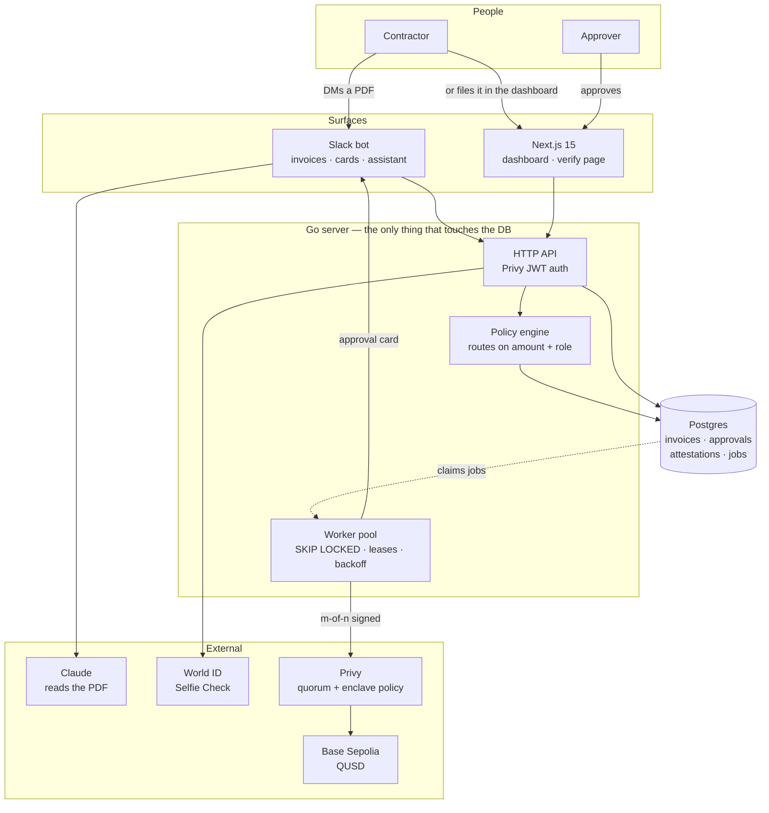
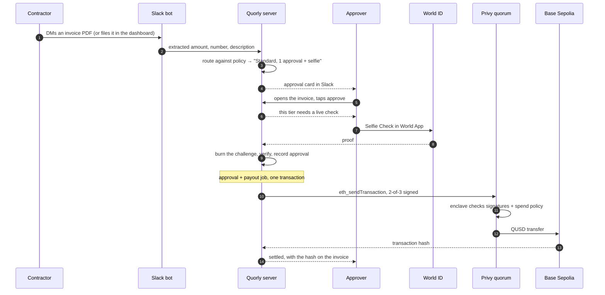

# Quorly

**Face-verified approvals for company money.**

A contractor raises an invoice — DM the PDF to the Slack bot, or file it from the
dashboard. Quorly reads it, routes it against the
company's approval policy, pings the manager who actually has authority, and — above
a dollar threshold — makes that manager pass a **World ID Selfie Check** before the
approval counts. Only then does a **Privy** treasury wallet release the payment, under
a key quorum and an enclave-enforced spend policy.

The gap it closes: today, "approve" is a button click authenticated by a session
cookie. A stolen laptop, a hijacked cookie or an over-eager automation can click it.
Quorly makes the human in the loop *provably* a live human, at the moment money moves.

---

## Architecture

```
apps/web     Next.js 15 — UI only. Renders what the API returns.
server/      Go — the whole backend: policy, Privy, World, Slack, workers.
contracts/   Foundry — QUSD, the test settlement token.
```

The Go server is the only thing that touches the database. The web app forwards the
viewer's Privy token and renders the response, so authorisation is decided in exactly
one place.



### The money path

Approvals and payouts are written in the **same transaction** — an approval can never
be recorded without its payout being scheduled, and a payout can never exist without
its approval. That's the transactional outbox, and it's why the queue lives in Postgres
rather than a separate broker: a broker reintroduces the dual-write problem the outbox
exists to solve.

```
approve ──┐
          ├── one transaction ──→ approvals row + jobs row
          ┘

worker pool ── SELECT … FOR UPDATE SKIP LOCKED
             ├─ payout        sign with the quorum and broadcast
             └─ slack_notify  tell the people who can act
```

The payout goes through the wallet's RPC endpoint as an `eth_sendTransaction`
carrying a threshold of quorum signatures, so Privy's enclave checks the signatures
*and* the spend policy in one pass and either broadcasts or refuses. One call, one
answer, and the transaction hash comes back rather than arriving later.

| Concern | How |
|---|---|
| Duplicate work | `jobs.idempotency_key` is UNIQUE; enqueuing twice collides |
| Worker crash | Jobs carry a lease; an expired lease makes them claimable again |
| Transient failure | Exponential backoff, jittered across `[d/4, d]` |
| Thundering herd | Jitter desynchronises a fleet retrying after an outage |
| Not-ready-yet | `RetryLater` reschedules without consuming an attempt |
| Permanent failure | Dead-lettered after `max_attempts`, never silently dropped |
| Backpressure | Bounded pool; never claims more than it can run |

---

## Privy — the rails and the controls

| Control | Where |
|---|---|
| **Server wallets** | Org treasury, created during setup |
| **Key quorums** | The treasury is owned by an m-of-n quorum. "Two approvals required" isn't app state we can flip — it's the wallet's owner |
| **Policies** | Mirrored into Privy's policy engine: settlement token only, allowlisted payees, per-transfer ceiling. Enforced in the TEE |
| **Member wallets** | Everyone on the roster gets one, so an invoice always has somewhere to be paid |

Requests carry one P-256 signature per authorization key, comma-separated in
`privy-authorization-signature`. A wallet owned by a 2-of-3 quorum rejects a request
bearing one signature — which is the point.

The signature covers a canonical JSON of the request: method, URL, body, and **every
`privy-*` header the request will actually send**. Signing the body but not the
idempotency key produces a valid signature for a different request, and Privy rejects
it as though the key were wrong.

## World ID — Selfie Check as a risk signal

Selfie Check is a *medium*-assurance credential: liveness and facial similarity, a
90-day window, and explicitly **no** one-person-one-account guarantee. So Quorly never
uses it for identity. Authority comes from the key quorum; Selfie Check answers one
question — *was a live human behind this click?*

- **Risk-tiered.** Under $500, no check. $500–$5k, one live check. Above that, two
  approvers each with a check under 180 seconds old.
- **Challenge-response.** The server mints a signed `rp_context` per approval and
  records its nonce as a single-use challenge bound to one invoice and one approver.
- **Burned before verifying**, so a slow verify can't be raced.
- **Fails safe.** No proof, stale proof, or reused proof and the approval doesn't record.

See [`FEEDBACK.md`](./FEEDBACK.md) for the integration feedback document.

---

## Run it

```bash
cp .env.example .env          # fill in DATABASE_URL at minimum
bun install

bun run migrate               # apply the schema
bun run dev:server            # Go API + worker pool on :8080
bun run dev:web               # Next.js on :3000

bun run test                  # Go suite, including queue integration tests
bun run test:contracts        # Foundry
```

With `PRIVY_APP_ID` unset everything runs in demo mode: Selfie Check and payouts are
simulated end to end. `OPENROUTER_API_KEY` turns the Slack assistant on; without it the
bot still files invoices and simply stops being able to talk about them.

```bash
quorlyctl invoice 2400 <org>   # file one and print the approval links
quorlyctl roster <org>         # who is on it and what they can do
quorlyctl syncpolicy <org>     # rebuild the payee allowlist from the roster
quorlyctl queue                # pending, claimed, dead
quorlyctl worldcheck           # prove the World signing key works
```

### Slack

Install via `/slack/install`. The callback provisions the workspace — an org keyed to
the team, the default rulebook, and the installer seeded as owner. Point the app's
Event Subscriptions at `<APP_URL>/slack/events`, Interactivity at
`/slack/interactions`, and the `/quorly` command at `/slack/commands`.

---

## The flow, end to end



Every step above has run against live infrastructure, not a mock:

| | |
|---|---|
| Settlement token | [`0xae29D08f…93FFA`](https://sepolia.basescan.org/token/0xae29D08fdD2B95424A950c8f674077BBECE93FFA) — QUSD, verified on Base Sepolia |
| Treasury | [`0x72816686…58cb03`](https://sepolia.basescan.org/address/0x72816686db49084622E87df0115530b02358cb03) — owned by a 2-of-3 key quorum |
| A settled payout | [`0xbb14dea2…e1ec8c`](https://sepolia.basescan.org/tx/0xbb14dea2c9064b1bf1edbf640624be31824449b26d7efa54170cfb32b9e1ec8c) — $2,000 released after a live Selfie Check |

## Ask it

Mention the bot in a channel or message it directly and it answers from the org's own
invoices — what is waiting on you, where a payment got to, why you cannot approve
something — and hands over the link that takes you into approving it.

The model has no tools and no database connection. Every fact is assembled server-side
first and passed in as context, and every link is one the server minted. Retrieval the
model controls is retrieval nobody can audit, and this is a system that moves money.
It cannot approve anything either: the worst a wrong answer costs is a wrong sentence,
because the link still lands on a page that checks who you are and asks for your face.

```
/quorly pending     open invoices
/quorly team        the roster and who can approve
/quorly wallet      your address and what it holds
/quorly treasury    what the company can pay from
/quorly policy      the tiers and what each one demands
/quorly whoami      which seat you hold here
```
